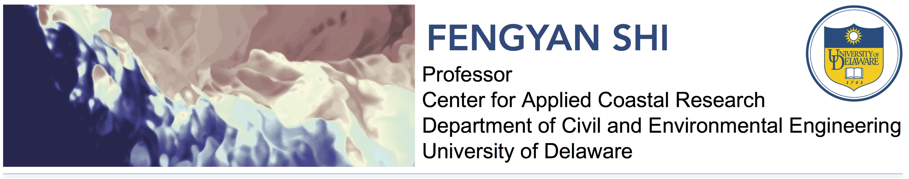

.. myweb documentation master file, created by
   sphinx-quickstart on Thu Aug 17 15:18:12 2017.
   You can adapt this file completely to your liking, but it should at least
   contain the root `toctree` directive.

NUMERICAL LABORATORY
=================================
| Learn about FUNWAVE-TVD | NHWAVE | NearCoM

.. toctree::
   :maxdepth: 2

   models
   publication
   gallery

